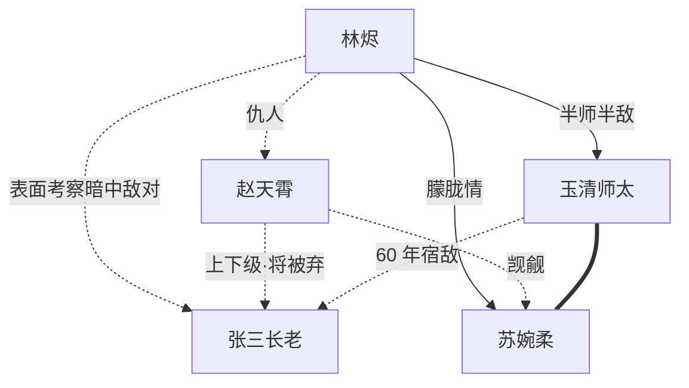

# 关系网

## 主角圈

### 林烬 ↔ 苏婉柔

- **关系类型**：朦胧情线（外门师弟妹 → 互相支持 → 隐情线）
- **强度**：第 5 章末 = 1（认识）；第 50 章末 = 3（信任）
- **关键节点**：
  - 第 1 章：苏婉柔旁观林烬被罚（旁观者视角，无对话）
  - 第 4 章：第一次对话（药圃外短句照面）
  - 第 12 章：苏婉柔察觉林烬实力变化，主动给一根灵草
  - 第 33 章：苏婉柔暗中救场（与师太配合）
  - 第 45 章：祭祀大典前夜递信
  - 第 50 章：祭祀大典场外相视一笑（互相承认）

### 林烬 ↔ 赵天霄

- **关系类型**：仇人
- **强度**：4（第 1 章起就是死敌）
- **关键节点**：
  - 第 1 章：赵天霄欺凌林烬，抢月例
  - 第 4 章：赵天霄在私下试探（怀疑林烬变了）
  - 第 5 章：林烬解析赤焰拳七寸反杀（小胜）
  - 第 8 章：赵被宗门审查，证据不足脱身，开始私下监视
  - 第 22 章：身份暴露
  - 第 30 章：退场

### 林烬 ↔ 玉清师太

- **关系类型**：半师半敌（外门管事 → 暗中观察 → 半结盟）
- **强度**：第 5 章末 = 1（认识）；第 50 章末 = 3（隐性结盟）
- **关键节点**：
  - 第 3 章：药圃外第一次正式对话（互相试探）
  - 第 14 章：林烬第二次主动求"清理任务"，师太冷眼看穿
  - 第 33 章：师太暗中助攻
  - 第 45 章：祭祀大典前夜，师太给林烬一句话提示
  - 第 50 章：师太与张三长老正面交锋（卷 1 末高潮）

### 林烬 ↔ 张三长老

- **关系类型**：表面温和考察 / 暗中敌对
- **强度**：第 15 章 = 1（认识）；第 50 章 = 4（明确死敌）
- **关键节点**：
  - 第 4 章：在赵天霄对话中"被提及"（不出场）
  - 第 14 章：师太提到他的名字
  - 第 15 章：张三长老首次正式出场，给林烬"考察"任务
  - 第 22 章：撇清和赵天霄的关系
  - 第 45-50 章：阴谋暴露 + 与师太交锋

## 反派圈

### 赵天霄 ↔ 张三长老

- **关系类型**：上下级（赵是张三的小弟，但张三准备弃子）
- **强度**：第 1 章 = 3，第 22 章 = 1（被切割）
- **关键节点**：
  - 玄霄宗内部的接洽人；张三给赵任务
  - 第 8 章：审查时张三暗中保下赵
  - 第 22 章：身份暴露后张三立刻切割

### 赵天霄 ↔ 苏婉柔

- **关系类型**：觊觎（单方面）
- **强度**：1
- **关键节点**：
  - 第 1 章：在欺凌林烬现场曾盯过苏婉柔几眼
  - 苏从不正眼看他，他不敢公开

## 配角圈

### 玉清师太 ↔ 苏婉柔

- **关系类型**：隐藏师徒 + 暗中守护人（师太知道苏母是青云宗二长老）
- **强度**：5（生死相托级）
- **关键节点**：
  - 苏 3 岁被宗门收养时，师太就在场
  - 师太一直暗中护着苏
  - 表面只是药圃管事 / 弟子关系
  - 卷 2 中段揭示

## 跨阵营

### 玉清师太 ↔ 张三长老

- **关系类型**：明面平级（同为外门管事 / 长老候补），暗中宿敌
- **强度**：5（不死不休级，60 年宿仇）
- **关键节点**：
  - 60 年前师太爱徒叛逃玄霄宗，张三正是当年接引人
  - 表面客客气气，几乎不交流
  - 第 45-50 章正面交锋（卷 1 末高潮）

### 林烬 ↔ 苏婉柔（卷 2 后扩展）

- **未来节点**（已规划）：
  - 卷 2 末：苏跟随林烬离开宗门
  - 卷 4：苏母身世揭露，二人关系变化
  - 卷 8：苏成为林烬最重要的非战斗伙伴

## 关系图（mermaid 概念）

